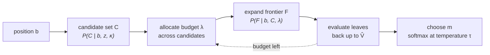
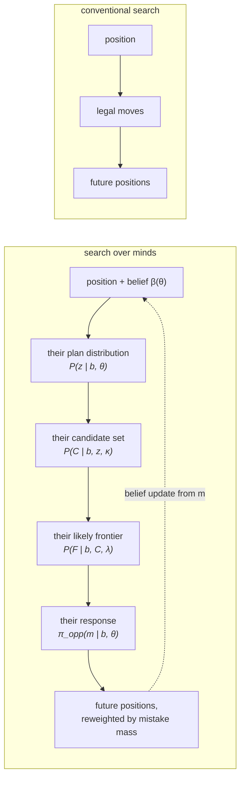
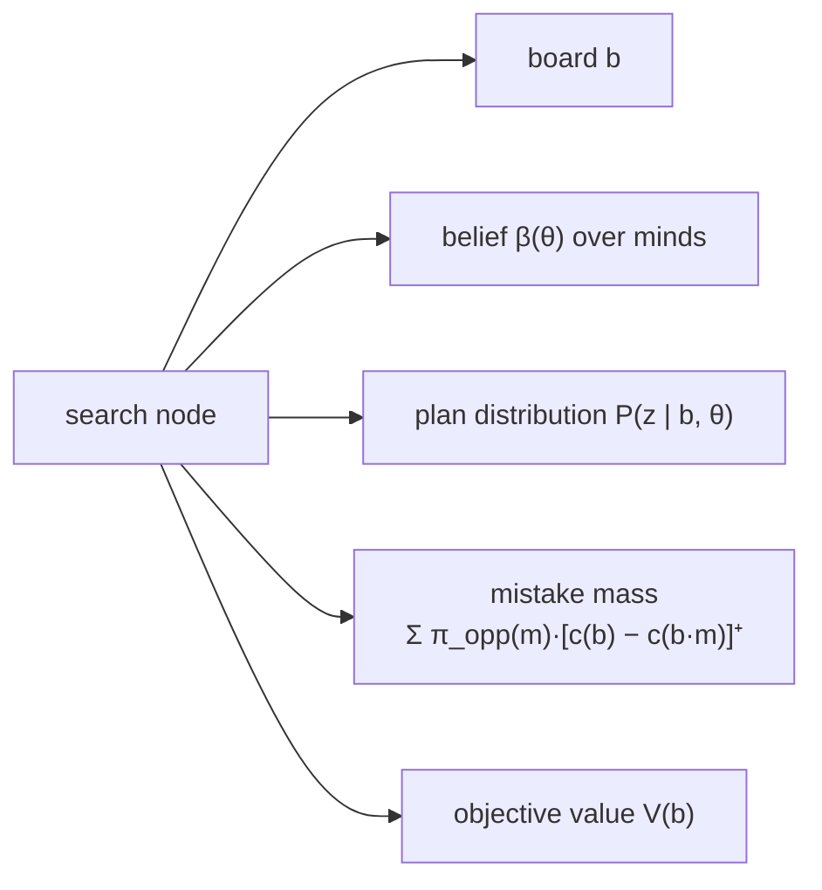
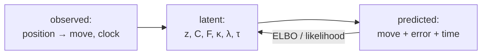
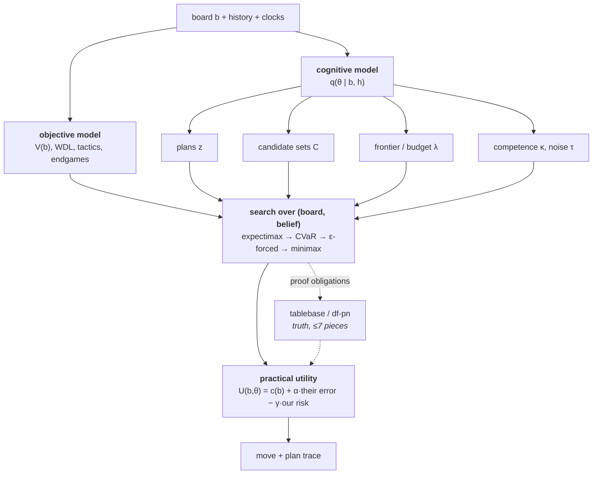
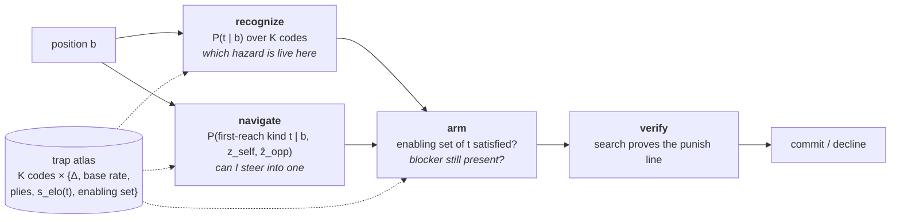
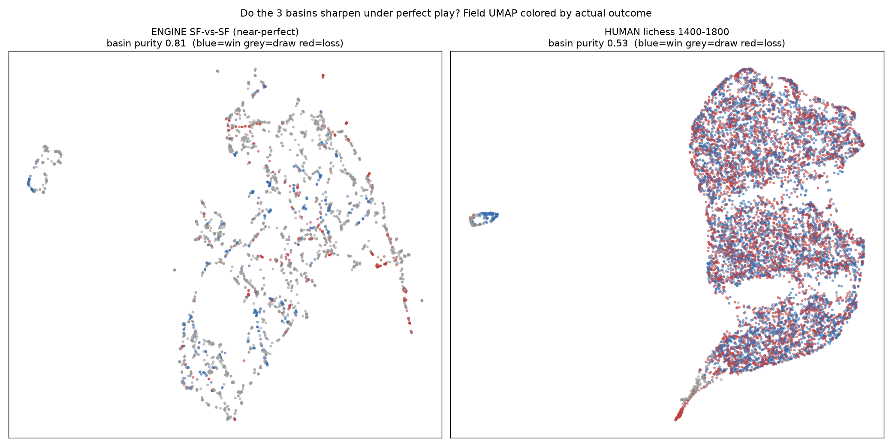

# catspace — chess in the latent space of a cat's mind

Cats are said to be opportunistic hunters. But opportunity doesn't just come to them. My cat goes to where the opportunity is. She studies the rats in the yard from various viewpoints, learning their behaviors and moving patterns. She also knows herself well; her coloring, her speed, the limits of her patience. She picks a spot under a shrub, camouflaged by the shadow of the leaves, and waits. Eventually, there's a sound and some motion in the bush. Her body language suddenly changes. She gets ready to pounce. A rat comes confidently running out of its hiding place at the wrong time.

That is also how I view chess.

Humans play strong chess on 10–100 positions of search, because they plan by making assumptions about their adversaries. Having a plan is the prerequisite to articulating it, which is necessary for interpretability. So here we try to make a chess engine that can plan like humans, hoping that we get interpretability as the reward.

**[JOURNAL.md](JOURNAL.md)** is the lab notebook written as the work happened.

## Planning

For amateurs like us, the plan is to take the center, develop our pieces, and castle our king to safety. Then duke it out in the middlegame, make a plan, focus our pieces on some weakness, and put pressure. Attack Attack Attack. If we're not attacking, then what are we even doing?

In one game, while we shuffle our pieces around, we see that by placing our rook on the d-file, our rookie would be taking a sneak peak at the opponent's queen through a couple of pieces. Sensing the future pin, we place the rook there, bring some more pieces into the action, and then push the d-pawn to break the center. After the dust settles, we end up winning a pawn, a solid advantage. We got this partly because we placed our rook in a nice spot, and partly because our opponent miscalculated.

## Adversarial Planning

The opponent has a veto, and may not miscalculate the way we hope. Chess is a
question of how long each side can keep vetoing before someone makes a mistake.
If nobody makes one, the game is a draw — which is why engine chess looks the way
it does.

So planning means steering the game toward areas of their weakness and away from
areas of ours. That might mean forcing them into a line where a defense
technically exists — objectively it's equal — but the defense is so hard to see
that the position is practically winning. Two things are needed for this: to know
the line intimately enough to navigate into it, and to know that *this* opponent
probably doesn't, so there's a hazard here they might fall into.

Which means we need to know where the hazards are, and which factors expose an
opponent to one, hopefully leaving them to miss the defense until it's too late.
Our opponent, of course, is doing the same thing to us.

So start with cognition. A human cannot consider all options; neither can an
engine. A handful of candidates get selected, searched to some depth, and a
decision comes out. Errors enter in three distinct places: the right move was
never a candidate, the search never went deep enough to see the point, or the
branch containing it was pruned early. Those are also engine behaviors, which is
what makes them modelable.

## The formal frame

We are not playing a board. We are playing a board **and** a mind, and only one
of the two is visible.

### 1. The state, and why it is partially observed

Write the joint state as

$$s_t \;=\; (b_t,\ \theta_t) \;\in\; \mathcal{B} \times \Theta$$

where $b_t$ is the board — plus move history, clocks, everything an engine
already sees — and $\theta_t$ is the opponent's **cognitive state**. We observe
$b_t$ exactly and $\theta_t$ never. That one asymmetry turns chess, a
perfect-information game, into a partially observed decision problem from our
seat:

$$\mathcal{M} \;=\; \big(\mathcal{S},\ \mathcal{A},\ T,\ \Omega,\ U\big),
\qquad \mathcal{S} = \mathcal{B}\times\Theta,
\qquad \mathcal{A}(b) = \{\,\text{legal moves at } b\,\},
\qquad \Omega = \mathcal{A} \times \mathbb{R}_{+}$$

An observation $\omega_t \in \Omega$ is their move together with the time they
spent on it. The transition factors into how their mind moves and how their mind
picks:

$$T(b',\theta' \mid b,\theta,a)\;=\;\underbrace{P(\theta' \mid \theta,\, b,\, a)}_{\text{cognitive drift}}
\;\cdot\!\!\sum_{m \,\in\, \mathcal{A}(b\cdot a)}\!\!
\underbrace{\pi_{\mathrm{opp}}\!\left(m \mid b\cdot a,\ \theta'\right)}_{\text{response model}}
\;\mathbf{1}\!\left[\,b' = b\cdot a\cdot m\,\right]$$

Because $\theta$ is hidden we carry a **belief over minds**,
$\beta_t(\theta) = P(\theta \mid h_t)$, and every move they make is evidence
about it:

$$\beta_{t+1}(\theta') \;\;\propto\;\; \sum_{\theta \in \Theta}
\underbrace{\pi_{\mathrm{opp}}(m_t \mid b_t, \theta)}_{\text{likelihood of what they just did}}
\;P(\theta' \mid \theta, b_t)\;\beta_t(\theta)$$

That is the thesis in one line: **their moves are observations of their mind.** A
conventional engine computes the same board and discards this likelihood.

Notation, once, for the rest of the document:

| symbol | meaning |
|---|---|
| $b$, $b\cdot m$ | board; board after move $m$ |
| $\theta = (z,\kappa,\lambda,\tau)$ | cognitive state: plan, competence, compute budget, decision noise |
| $\beta_t(\theta)$ | our belief over their cognitive state at ply $t$ |
| $z$ | latent plan |
| $C \subseteq \mathcal{A}(b)$ | candidate set they actually consider |
| $F$ | search frontier — the subtree they actually expand |
| $V(b)$ | optimal-play reference value |
| $\hat V_\theta^{F}(b)$ | *their* value, from leaf evals backed up over $F$ |
| $c_{\pi}(b)$ | committor: $P(\text{win} \mid b)$ under the play measure $\pi$ |
| $U(b,\theta)$ | our practical utility against *this* decision-maker |
| $t = (\mathrm{m}, \pi_f)$ | trap kind (§13): mechanism × blindness profile |
| $s_\theta(t)$ | their susceptibility to kind $t$ — a $K$-vector, not a scalar |

### 2. The world model — what is objectively true

The foundation is an ordinary strong chess representation, taking board, history,
rating and clock, and producing an embedding $\phi(b)$ together with an
optimal-play value $V(b)$ (or the WDL triple) and the usual tactical, positional
and endgame readouts. This layer answers only:

> "What is objectively happening on the board?"

Modern chess networks already do this well, so we take it as given and define
everything else as a deviation from it. One caveat carries through the whole
document: chess is unsolved above seven pieces, so $V$ is a strong **reference**,
not truth. It enters the theory as the baseline that fallible play departs from,
never as an oracle.

---

### 3. The cognitive model — the opponent as a bounded reasoner


The usual opponent model predicts a move, $P(m \mid b)$. We want the process that
*produced* the move, because the process is what generalizes to positions they
have never seen and what tells us where they will break. So we fit an approximate
posterior over minds,

$$q_\psi(\theta \mid b_t, h_t) \;\approx\; P(\theta \mid b_t, h_t),
\qquad \theta = (\,\underbrace{z}_{\text{plan}},\ \underbrace{\kappa}_{\text{competence}},\ \underbrace{\lambda}_{\text{budget}},\ \underbrace{\tau}_{\text{noise}}\,)$$

and we decompose the move they finally play into the four failure points of any
bounded search — what they aim at, what they look at, how far they look, and how
noisily they choose:

$$\pi_{\mathrm{opp}}(m \mid b,\theta)
\;=\; \sum_{z} P(z \mid b,\theta)
\!\!\sum_{C \,\subseteq\, \mathcal{A}(b)}\!\! P(C \mid b, z, \kappa)
\!\!\sum_{F} P(F \mid b, C, \lambda)\;
\underbrace{\frac{\exp\!\big(\hat V^{F}_\theta(b\cdot m)/\tau\big)\,\mathbf{1}[m \in C]}{\sum_{m' \in C}\exp\!\big(\hat V^{F}_\theta(b\cdot m')/\tau\big)}}_{\text{choice given what they saw}}$$

Read the sum right to left and it is a taxonomy of error. They can lose because
$\tau$ is large and they were careless; because $F$ was too shallow to see the
refutation; because the right move was never in $C$ at all; or because $z$ pointed
them at the wrong side of the board. **These are different failures and they need
different exploits**, which is why the model is factored rather than lumped into a
single softmax over moves.

The engine keeps its uncertainty explicit rather than committing to a point
estimate. A belief is a sentence like:

> "They are probably playing for a kingside attack, and probably will not notice
> the defensive resource on move 3."

#### 3.1 Plans, $z$

Humans do not think in moves; they think in goals, and moves are what goals
compile down to. Introduce a latent plan $z$ ranging over things like *attack the
king*, *trade into a won endgame*, *win material*, *seize the open file*,
*provoke a pawn weakness*, *complicate*. We do not hand-enumerate these — the
vocabulary is learned, so it is whatever actually predicts move sequences, and a
plan is identified by its behavioral signature:

$$P(z \mid b,\theta) \;\propto\; \exp\big(\langle \phi(b),\, \psi_z \rangle\big)\,P(z \mid \theta),
\qquad z \text{ is a plan iff it makes a sequence of moves cheap to predict}$$

A plan earns its place when conditioning on it compresses the next several moves,
not just the next one. Formally, $z$ is worth having when
$I\big(z;\,m_{t:t+k} \mid b_t\big)$ stays large as $k$ grows — the same criterion
that separates a real plan from a one-move tactic.

#### 3.2 Candidate sets, $C$

A middlegame position has ~40 legal moves and a human considers three to five.
The candidate set is therefore a hard filter applied *before* any evaluation
happens:

$$P(C \mid b,z,\kappa)\;=\;\prod_{m \in C} \sigma\!\big(g_\kappa(m \mid b,z)\big)
\prod_{m \notin C}\Big(1 - \sigma\!\big(g_\kappa(m \mid b,z)\big)\Big),
\qquad \mathbb{E}\,|C| \;\approx\; 3\text{–}5 \;\ll\; |\mathcal{A}(b)|$$

The consequential quantity is the probability that the move that saves them is
outside the filter, $P\big(m^\star \notin C \mid b,\theta\big)$. **Most mistakes
are already made by this point.** It is usually not that the player evaluated the
right move and rejected it; the right move was never on the list. An exploit
aimed at this failure mode looks nothing like an exploit aimed at shallow search —
here we want the saving move to be *ugly*, not deep.

---

### 4. Their search, $F$


Thinking, for both humans and engines, is a budgeted walk over a tree:



The hidden variables are which branches got expanded, how deeply, which were
never touched, and when calculation stopped. Model the frontier $F$ as a subtree
grown under a budget:

$$P(F \mid b, C, \lambda)\;=\;\prod_{\nu \,\in\, F}
\underbrace{P\big(\text{expand } \nu \mid \text{parent}, \lambda\big)}_{\text{forcing moves get expanded, quiet ones do not}},
\qquad \text{s.t.}\quad \mathbb{E}\,|F| \le \lambda$$

Two properties matter. The frontier is **selectively deep** — checks, captures and
threats get followed far past the average depth, while quiet moves are cut
immediately, which is exactly why quiet refutations are the ones that get missed.
And their value is a backup over *their* frontier, not over the true tree:

$$\hat V^{F}_\theta(b) \;=\;
\begin{cases}
V_\kappa(b) + \varepsilon_\kappa(b), & b \in \partial F \quad \text{(leaf: their eval, with their error)}\\[4pt]
\max_{m} \big(-\hat V^{F}_\theta(b\cdot m)\big), & \text{otherwise}
\end{cases}$$

so their evaluation error at the root is inherited from two sources — a shallow
$\partial F$ that stops before the point is revealed, and a biased leaf evaluator
$\varepsilon_\kappa$. The gap we exploit is
$\big|\hat V^{F}_\theta(b) - V(b)\big|$, and we can predict where it is large
before they ever sit down in the position.

---

### 5. Traps, stated properly

A traditional engine's definition of a trap is a one-liner:

> A tactic exists.

Ours has to talk about the mind, because a tactic they will find is not a trap:

> A tactic exists **and** their reasoning process is unlikely to reach the defense.

Make it a number. For a candidate move $a$, define the **trap value** as the
evaluation swing available to us, weighted by the probability they walk into it:

$$\mathrm{Trap}(a \mid b,\theta)\;=\;\sum_{m \,\in\, \mathcal{A}(b\cdot a)}
\pi_{\mathrm{opp}}(m \mid b\cdot a,\theta)\;\Big[\,V\big(b\cdot a\cdot m\big) - V\big(b \cdot a\big)\Big]$$

The whole point is that this is an expectation under $\pi_{\mathrm{opp}}$, not a
minimax. Against a perfect defender $\pi_{\mathrm{opp}}$ concentrates on $m^\star$
and $\mathrm{Trap} \to 0$; the definition degrades gracefully into "no trap
exists." A trap is *practical* precisely when three conditions hold at once:

$$\underbrace{\exists\,a:\; V(b\cdot a\cdot m^{\text{nat}}) \gg V(b)}_{\text{(i) the punish line exists}}
\qquad
\underbrace{P\big(m^\star \notin C \ \text{ or } \ m^\star \notin F\big) \text{ is large}}_{\text{(ii) the defense is hard to find}}
\qquad
\underbrace{\pi_{\mathrm{opp}}(m^{\text{nat}}) \gg \pi_{\mathrm{opp}}(m^\star)}_{\text{(iii) the natural move is attractive}}$$

Condition (ii) is where the cognitive model does work no evaluation function can:
"hard to find" is a statement about $C$ and $F$, not about $V$. A concrete shape:

```text
position                     V = +0.2      (objectively balanced)
their options
  m_nat  natural, thematic   π = 0.71      →  V = +4.5   after our punish
  m*     only defense, quiet π = 0.06      →  V = +0.2   holds
Trap(a) ≈ 0.71 · (+4.3) + …  ≈ +3.1
```

The trap does not work because the position is good. It works because it is
aimed at a *predictable* reasoning failure — and predictability is the thing we
can estimate, validate, and be wrong about in a measurable way.

---

### 6. Search over minds


A conventional engine expands boards. We expand boards paired with beliefs about
the mind that will have to answer them:



Each node therefore carries a belief, not just a board:



The extra state is what makes the tree *asymmetric*: a line that is objectively
equal but sits on top of a large mistake mass is worth expanding, and a line that
is objectively better but demands nothing of them is not.

---

### 7. The objective — what we actually maximize

A conventional engine solves $\max_a V(b\cdot a)$: maximize objective board value,
which is correct if and only if the reply comes from a perfect adversary. We solve
a different problem — maximize expected outcome against *this* decision-maker,
integrating over our uncertainty about their mind:

$$a^\star \;=\; \arg\max_{a \,\in\, \mathcal{A}(b)}\;
\mathbb{E}_{\theta \sim \beta_t}
\Big[\ \mathbb{E}_{m \sim \pi_{\mathrm{opp}}(\cdot \mid b\cdot a,\,\theta)}
\big[\,U\big(b\cdot a\cdot m,\ \theta'\big)\,\big]\ \Big]$$

The utility is not the objective evaluation. It is the objective evaluation plus
everything that follows from playing a person, and it decomposes as

$$U(b,\theta)\;=\;\underbrace{c_{\pi}(b)}_{\substack{\text{win probability under}\\ \text{real, not perfect, play}}}
\;+\;\alpha\!\!\underbrace{\sum_{m}\pi_{\mathrm{opp}}(m\mid b,\theta)\big[c_\pi(b) - c_\pi(b\cdot m)\big]^{+}}_{\text{their expected error flux}}
\;-\;\underbrace{\gamma\,\mathrm{Risk}_{\alpha}\big(c_\pi \mid z_{\text{self}}\big)}_{\substack{\text{our own error, incl.}\\ \text{can we execute the line}}}$$

Three consequences worth stating plainly. First, **an objectively equal move can
be strictly better**, whenever the second term outweighs nothing at all — this is
formally why a "dubious" sacrifice can be correct. Second, the risk term is not
decoration: a line only counts if *we* can hold it, so execution difficulty
multiplies value. Third, the whole thing is governed by one dial:

$$\underbrace{\mathbb{E}_{\pi_{\mathrm{opp}}}[\cdot]}_{\text{expectimax}}
\;\longrightarrow\;
\underbrace{\mathrm{CVaR}_\alpha[\cdot]}_{\text{cautious}}
\;\longrightarrow\;
\underbrace{\inf_{m:\,\pi_{\mathrm{opp}}(m)\ge\epsilon}[\cdot]}_{\epsilon\text{-forced}}
\;\longrightarrow\;
\underbrace{\inf_{m \,\in\, \mathcal{A}}[\cdot]}_{\text{minimax}}$$

Sliding right quantifies over more of their probability mass, and at the right
endpoint we recover a classical engine exactly. **The opponent model is an
optimization, never a dependency** — if it is wrong we degrade toward minimax
rather than losing.

---

### 8. Objects that need proof, not probability

One boundary keeps the framework honest. "Mate in five" is not a probabilistic
claim; it is a quantifier alternation — $\exists$ our strategy, $\forall$ their
legal replies, we mate within five. No learned field can represent it and none
should try:

| regime | claim | quantifier | instrument |
|---|---|---|---|
| **forced** | mate / tablebase win exists | $\exists$ ours, $\forall$ theirs | search & tablebase — *proof* |
| **navigational** | $P(\text{reach } G \text{, avoid } B \mid \pi) \ge 1-\varepsilon$ | over a play measure | learned fields — *estimate* |

So probability is used for steering and proof is used for closing, and an
$\varepsilon$-forced line is the explicit hybrid: a line proved after pruning
their replies to those with $\pi_{\mathrm{opp}} \ge \varepsilon$, carrying its own
soundness bound $\prod_i (1-\delta_i)$ over the pruned mass. Everything the
opponent model touches is labeled as an estimate; everything a tablebase touches
is labeled as truth.

---

### 9. Learning the hidden variables

The plans, candidate sets and frontiers above are latent — no dataset labels
them. They are recovered by fitting the factored model to observed play, which
makes the training order a consequence of the factorization rather than an
arbitrary curriculum:

| stage | learns | fit to | supervises |
|---|---|---|---|
| 1 | $P(m \mid b, \text{rating})$ | human games | the base response model |
| 2 | $V(b)$, WDL, endgames | strong engines & tablebases | the objective reference |
| 3 | $P(\text{error} \mid b, \text{rating})$ | engine-annotated human games | where $\hat V^F_\theta$ departs from $V$ |
| 4 | difficulty, only-move-ness, $|C|$, depth | engine analysis + clocks | the components of $\theta$ |
| 5 | $q_\psi(\theta \mid b,h)$, $\pi_{\mathrm{opp}}$ | held-out human play | the joint latent model |
| 6 | our policy under $U$ | self-play vs. a population of $\theta$ | adaptation |

Stage 5 is the one that has to hold up: fit the latent process end to end and it
must reproduce not only human *moves* but human *mistake patterns* and human
*search behavior* — an opponent model that predicts moves while mispredicting
errors is useless to us, since the error term is what we steer with.



Stage 6 trains against a *population* of opponent models — aggressive, defensive,
tactical, positional, across ratings and time controls — because a policy tuned to
one $\theta$ is not adaptation, it is overfitting to one person.

---

### 10. The architecture this implies

A purely neural engine is unnecessary. Classical search is already excellent at
verification, and learned models are only needed where classical engines have
nothing to say — opponent modeling, planning, uncertainty, human behavior. Split
along that line:



---

### 11. Explainability as a consequence, not a feature


This is the payoff of insisting on latent variables rather than one scalar. A
conventional engine can only report the value of its search:

```text
evaluation: +0.63
```

Our decision is a weighted sum over named quantities, so the trace is just the
terms of that sum printed out:

```text
belief about opponent      kingside attack (p = 0.62), ELO-est 1740 ± 90, n_obs = 24
their likely candidates    1. Qh5  (0.44)   2. Ng5  (0.21)   3. Bxf7 (0.12)
critical defense           Kh8  — quiet, not forcing
  P(in candidate set C)    0.31
  P(reached in frontier F) 0.58   →  P(finds it) = 0.18
my move: Bxh6 (sacrifice)
  objective value  V       +0.2      (equal — a classical engine declines this)
  their error flux         +0.51     (α-weighted, from π_opp above)
  my execution risk        −0.06
  practical win prob.      0.70
verdict                    equal on the board, winning against this opponent
```

Every line is a number the model already had to compute in order to choose, which
is the point: interpretability is not a reporting layer bolted on afterward, it
falls out of having a factored model at all. It is also what makes the engine
**falsifiable** — "P(finds it) = 0.18" is a claim that can be checked against what
they actually play, and a model that is confidently wrong here can be caught.

---

### 12. Against traditional engines

This probably does not beat Stockfish or Lc0 in engine-versus-engine play, and it
is not supposed to. The two systems optimize different functionals:

$$\text{classical:}\quad \max_a \inf_{m \,\in\, \mathcal{A}} V
\qquad\qquad
\text{here:}\quad \max_a \mathbb{E}_{\theta \sim \beta}\,\mathbb{E}_{m \sim \pi_{\mathrm{opp}}}\,U$$

Against a perfect adversary $\pi_{\mathrm{opp}}$ collapses onto the best move, the
error-flux term vanishes, and the objective reduces to the classical one — minus
whatever we lose to approximating $V$. So the honest prediction is: no edge
against perfect play, by construction, and an edge exactly where the opponent is
bounded — playing humans, adapting mid-match, choosing practical positions,
setting problems that are hard *for them*, and exploiting failures we predicted in
advance.

The falsifiable version of the claim: the advantage should scale with the
opponent's error mass, and vanish as it goes to zero.

---

### 13. Traps as a discrete vocabulary

Everything above treats a trap as a per-position integral, which makes every
position its own special case: nothing learned about one trap transfers to the
next. But traps evidently come in *kinds* — a back-rank mate, a knight fork after
a loose piece, an overloaded defender — and a kind is a thing you can count,
name, and hold statistics about. So introduce a discrete latent over hazards and
factor the trap value through it:

$$\mathrm{Trap}(a \mid b,\theta)\;\approx\;\sum_{t}
\underbrace{P(t \mid b\cdot a)}_{\text{which hazard is here}}\;\cdot\;
\underbrace{\Delta(t)}_{\substack{\text{its swing, pooled} \\ \text{over instances}}}\;\cdot\;
\underbrace{s_\theta(t)}_{\substack{\text{does \textit{this} mind} \\ \text{fall for kind } t}}$$

The third factor is the reason to do this at all. Opponent modeling collapses
from a function over all positions to a $K$-vector per player — a **susceptibility
spectrum** — which is what makes per-individual modeling data-feasible at all. It
takes the shape our own feasibility work says is the only affordable one, a
per-player residual on a population prior:

$$s_\theta(t)\;=\;\sigma\big(\underbrace{\ell_{\mathrm{elo}}(t)}_{\text{population at their rating}}
\;+\;\underbrace{u_\theta(t)}_{\text{their residual},\ u_\theta \sim \mathcal{N}(0,\Sigma)}\big)$$

It also upgrades $\kappa$ from a scalar to a vector, which is what "tactically
sharp, positionally clueless" has always meant.

#### 13.1 Quantize the swing, not the position

Quantizing $\phi(b)$ at the checkpoint does not work, and we know it does not:
clustering position embeddings yields a basin codebook whose medoids are **real
openings** — a material-and-opening classifier, not a taxonomy of hazards.

A trap is not a position; it is a *relation* between three of them — where you
stand, what they will play, and what they needed to play. So quantize the swing
signature:

$$x \;=\; \Big(\ \phi(b\cdot a),\ \ \underbrace{\phi(b\cdot a\cdot m^{\text{nat}}) - \phi(b\cdot a)}_{\text{the punish}},\ \ \underbrace{\phi(b\cdot a\cdot m^{\star}) - \phi(b\cdot a)}_{\text{the defense they miss}}\ \Big)$$

and quantize it in a space trained to be predictively sufficient for *the miss*,
not to reconstruct the input. Codes must be behaviorally defined, so the
equivalence relation being approximated is exchangeability under both factors:

$$x \sim x' \iff
P(\text{miss} \mid x,\theta) = P(\text{miss} \mid x',\theta)\quad \forall \theta
\qquad\text{and}\qquad \Delta(x) = \Delta(x')$$

The codebook is then a finite approximation of $\mathcal{X}/\!\sim$, and each code
is a **technique**: a mechanism plus the conditions under which minds miss it.

#### 13.2 The kind is a product, because misses have causes

The same geometric motif gets missed for different reasons, and different reasons
demand opposite setups — so a single code is the wrong object. Factor the kind:

$$t \;=\; \big(\ \underbrace{\mathrm{m}}_{\text{mechanism}},\ \ \underbrace{\pi_f}_{\text{blindness profile}}\ \big)$$

The blindness factor is not a new model; it falls out of the factored
$\pi_{\mathrm{opp}}$ from §3–4, because the miss decomposes over exactly the
failure points already there:

$$1 - P(\text{find } m^\star) \;=\;
\underbrace{P(m^\star \notin C)}_{\text{omission}}
\;+\;\underbrace{P(m^\star \in C,\ m^\star \notin \partial F)}_{\text{horizon}}
\;+\;\underbrace{P(\text{seen, chose wrong} \mid \tau)}_{\text{slip}}
\;+\;\underbrace{P(z \text{ pointed elsewhere})}_{\text{misdirection}}$$

Every mined instance therefore carries a posterior over *why it worked*, and that
posterior is a soft label — supervision for free, from a decomposition we already
committed to. This is also why the quantizer must be **product or residual**, not
a single codebook: one codebook partitions, and a partition cannot express that
the same mechanism appears with several blindness profiles, or that a coarse kind
contains finer ones.

The blindness mode is not a diagnostic label. It dictates how the trap is armed:

| blindness mode | the hidden variable | to arm a trap of this kind, make the defense… |
|---|---|---|
| **omission** | $C$ — never a candidate | **ugly** — anti-thematic, backward, self-undefending |
| **horizon** | $F$ — beyond the frontier | **quiet and long** — no checks or captures on the path |
| **misdirection** | $z$ — wrong plan | irrelevant to the plan they are already committed to |
| **slip** | $\tau$ — noisy choice | one of many near-equal branches, under time pressure |

#### 13.3 Two questions, now separable

"Where are the traps" and "what kind are they" are different objects, and
discretization is what lets them be learned apart:



Navigation is the existing first-hit field, and a codebook simplifies it
sharply: the goal tower currently needs an arbitrary goal $g$, but with a finite
codebook the goal set **embeds once**, so a state sweeps every trap kind in $K$
dot products. Each code carries its own calibrated statistics — swing, base rate,
expected plies to spring, per-Elo susceptibility — and its **enabling set**, the
predicate that must hold for the mechanism to be live. That last piece is what
makes an "armed tactic" a finite state to maintain (watch the blocker, activate
when it disappears) instead of a per-position recomputation.

#### 13.4 What would kill this

The idea has an honest failure mode and should be built so it announces itself.

- **Sufficiency — the real gate.** The code must be a sufficient statistic for the
  miss: $I(\text{miss};\,x \mid t,\theta)\approx 0$, measured as the likelihood the
  full continuous $x$ adds over the code alone. If continuous $x$ keeps winning,
  traps are a continuum and quantization is only a naming convenience — that is a
  publishable negative result, not something to bury.
- **Collapse.** `usage_perplexity` in `catspace/concepts.py` is already the
  collapse metric; EMA codebooks with dead-code reset are the mitigation.
- **Non-canonicity.** Codes will not be stable across seeds (the SAE literature
  reports overlap as low as ~30%). So accept a code on *leverage plus held-out
  confirmation*, never on identity, and pool candidates across seeds.
- **Winner's curse.** Screen on one split; re-estimate swing and susceptibility on
  a disjoint split of games; report only confirmation-split effects.
- **Budget for $K$.** From 1.89M mined checkpoints at ~100 events per
  (code × Elo-bin) cell over 8 bins, roughly 2.4k codes is the ceiling before
  cells starve — so $K \approx 512\text{–}2048$ fine with an RVQ coarse level of
  ~64 that is very well estimated. (Arithmetic from corpus size; not yet a
  measured verdict.)

This also replaces something concretely broken. `CheckpointBank.query` currently
defines trap identity by **exact piece placement** — the FEN prefix as a
dictionary key — so the same motif shifted one file over is a different trap and
generalization is zero by construction. The codebook is the principled
replacement for that key. And `AnyHazardHead` in the encoder is documented as the
*aggregate* hazard $\kappa_0$, with per-atom keys anticipated: the codes are those
atoms, and the aggregate head is currently marginalizing over exactly the
distinction §13 is trying to recover.

---

### In one sentence

A conventional engine answers "what is the best move?". We want an engine that
answers:

> "What move creates the best future, given what my opponent understands, what
> they are likely to consider, what they are likely to miss, and how their plans
> interact with mine?"

The board is only half the game. The other half is the mind across the board.

---

## From the framework to the code

The five components map onto the objects above — $\theta$, $z$, $C$, $F$, $U$ —
which is how you find where a piece of this belongs:

| component | formal object | job | where |
|---|---|---|---|
| **Encoder** | $\phi(b)$, $V(b)$ | positions → representation (64-token relational JEPA; frozen lc0 trunk as the incumbent) | `catspace/encoder/` |
| **Predictor** | $\pi_{\mathrm{opp}}$, $q_\psi(\theta \mid b,h)$, $c_\pi$, error flux, $P(t \mid b)$, $s_\theta(t)$ | what's coming, against whom: hazard/reach fields, atlas statistics, committor value, opponent move models, endgame ground truth (Syzygy, DTM) | `catspace/predictor/` |
| **Search** | the $\arg\max$, the expectimax→minimax knob, proofs | verify and navigate: the MCTS core + goal-conditioned navigation | `catspace/search/` |
| **Planner** | $z$, subgoal chains, $\mathrm{Trap}(\cdot)$ | choose what to steer toward; plans as chains of opponent-error structures | `catspace/planner/` |
| **Memory** | goal banks, style retrieval, plan ledger, the trap atlas ($K$ codes + statistics) | stored structures: the checkpoint/atom bank lands here | `catspace/memory/` |

The quantizer itself is a `ConceptQuantizer` in `catspace/concepts.py` (the
registry holds k-means today; §13 wants RVQ/PQ beside it), and §13's recognize
step replaces the FEN-prefix grouping in `catspace/planner/trap_trace.py`.

Much of the formalism above is ahead of the code — the belief update over $\theta$
and the full factored $\pi_{\mathrm{opp}}$ are not implemented yet, and §13 is a
design, not a result. What exists is listed under
[Findings so far](#findings-so-far-each-number-is-a-committed-script-verdict-stories-in-journalmd);
the table says where each piece lands when it is built.

Support packages: `catspace/{data,train,style,harness,nn,engine,...}` (data
plumbing, training scaffold, player-style models, play harness, legacy). Old
import paths are kept as one-line aliases — pickled checkpoints and every
historical script still run.

## The repo, at a glance

| | |
|---|---|
| `catspace/` | the engine (five components above) |
| `tools/` | standalone probes & figure generators — every probe prints `VERDICT` lines and emits figures ([docs/PROBING.md](docs/PROBING.md)) |
| `scripts/` | canonical entry points (train / eval / play / launch) |
| `experiments/` | the full runnable lab notebook, chronologically honest |
| `docs/` | THESIS, COMPONENTS, TESTING, RUNBOOK, GLOSSARY, PROBING |
| `artifacts/` | run logs, checkpoints, figures (curated history) |
| `data/` | DVC-tracked datasets (pointers in git, bytes outside) |
| `ui/` | engine interface (UCI + plan-trace UI, scaffolding) |
| `JOURNAL.md` | the lab notebook — hypotheses, negative results, retractions |
| `MILESTONES.md` | the roadmap and dated design decisions |

## How research is conducted here

- **Best shot first, no A/B staging.** The complete target design is built in one
  go; attribution on failure is recovered by binary-searching components against
  known-good incumbents (the shelved M1–M5 stack).
- **Numbers are verdicts.** No number appears in docs or the journal unless a
  script printed it. Losses ship with executable invariant tests
  (`experiments/losses.py`); training runs carry collapse gates (effective rank).
- **Probing follows the field's best practice** — RankMe/LiDAR spectral health,
  frozen linear+kNN probes with group-aware splits, CKA, proper scoring rules for
  probability fields, quasimetric axioms, minimal-pair causal ablation; figures
  follow the FAIR / NVIDIA-robotics conventions (Clopper–Pearson intervals,
  green/red retrieval grids). See [docs/PROBING.md](docs/PROBING.md).
- **Interpretability is a measured endpoint:** faithfulness (remove the claimed
  structure → the decision must change), legibility (per-move traces with
  calibrated numbers), plan sparsity/stability, human-concept alignment.

## Findings so far (each number is a committed script verdict; stories in JOURNAL.md)

- **Per-player style is recoverable and exploitable — but only via retrieval**
  ("infer-then-condition": a recovered style vector overfits as a predictor,
  works as a retriever; +0.006–0.009 nats over the rating baseline).
- **You can estimate who you're playing from their moves alone** (Elo-MAE 142
  after 40 observed moves, vs 205 uninformed).
- **Blunder risk is measurable and asymmetric** (SF-refereed committor swings:
  ρ≈0.64 with realized crossings; weaker opponents cross 1.4–3× more in the same
  positions). **Where errors happen is position-driven; who errs is
  strength-driven** (crossing locations found at ~4.8× base rate, ranking nearly
  rating-invariant).
- **Reachability is a probability, not a distance** (the quasimetric field could
  not carry opponent-conditioning; the first-hit probability field can, with
  CI-separated style-lift). **Train==play matters more than data volume**
  (fine-tuning the field on our own steered games: +0.031 nats and the largest
  play-strength lever of the M5 campaign; 23× more passive data: nothing).
- **1.89M human trap checkpoints** mined from 2.39M engine-annotated lichess
  games (0.79/game) now ground the hazard energy.



*The object of study in one picture: the same embedding colored by game outcome.
Near-perfect play (left) separates into basins (purity 0.81); human play (right)
blurs to 0.53. That blur is fallible play crossing outcome barriers — exactly
what the planner steers with.*

## Running it

```bash
pip install -e .[nn]     # torch is the [nn] extra; lczerolens for the lc0 encoder
pytest                   # 268 tests
scripts/run_jepa_pretrain.sh   # the current build: corpus -> encoder pretraining
```

More in [docs/RUNBOOK.md](docs/RUNBOOK.md) and [scripts/README.md](scripts/README.md).

## Status (2026-07-30)

Pivoted to the anchored-JEPA architecture (Kaveh's draft): checkpoint corpus
mined (33.8M games scanned), encoder pretraining in flight. The prior stack
(M0–M5: metastability basins, style models, reach fields, chute planner, MCTS
probe — and its complete verdict ladder, 0.045→0.095 vs the 0.125 baseline) is
shelved intact as the known-good component library. History: `docs/archive/`,
`JOURNAL.md`.

## Failed attempts

Negative results are the cheapest thing this project produces and the most
expensive thing to rediscover, so they live here rather than in a footnote. The
rule: an entry goes in when a script printed the verdict that killed the idea —
what was tried, what happened, and what it now forbids. Full stories, with dates
and numbers, are in [JOURNAL.md](JOURNAL.md).

| attempt | what happened | what it forbids now |
|---|---|---|
| **Quasimetric reach field** — model reachability as a learned distance $d(s,g)$ | Could not carry opponent-conditioning: a distance is a property of the board, but reachability against a fallible player is a property of the *play measure*, so there was nowhere for $z_{\mathrm{opp}}$ to enter. Replaced by the first-hit probability field, which conditions cleanly and shows CI-separated style-lift. | Reachability is a probability, not a distance. Anything player-conditioned must be a measure over trajectories. |
| **Style vector as an additive predictor** — feed a recovered per-player $z$ straight into the move model | Overfit; the recovered vector memorizes the player's training games instead of generalizing. The same vector works as a *retriever* (nearest clean styles, Elo-banded, blend their predictions): +0.006–0.009 nats over the rating baseline. | Infer-then-condition. A recovered $z$ is a key into a bank, not a feature to concatenate. |
| **More passive data** — 23× the volume of ordinary human games for the reach field | Nothing. Meanwhile fine-tuning on our own steered games — a tiny corpus, but drawn from the distribution we actually play in — gave +0.031 nats and was the largest single play-strength lever of the M5 campaign. | Train==play beats data volume. Distribution match is the scarce resource, not samples. |
| **Quantizing position embeddings to find hazard structure** | The medoids came out as *real openings* — the codebook recovered material and opening family, which is genuine structure and entirely the wrong structure. Traps are relations between positions, not positions. | §13 quantizes the swing signature (punish and defense displacements), never $\phi(b)$ alone. |
| **One MSM spanning irreversibility strata** | Fails Chapman–Kolmogorov / implied-timescale validation, as expected: captures and pawn moves are absorbing boundaries, so the process is not Markovian across them. Within-stratum G-PCCA plus explicit DAG layering is the sound decomposition. | Never ask one coarse-graining to span an irreversible boundary. |
| **Per-individual transition kernels** | Data-starved by 1–2 orders of magnitude before a line of code was written: a coarse kernel needs ~10⁵ games per player and an active player has 10³–10⁴ total. | Model an individual as a residual on an Elo-bin (or behavioral-cluster) prior — the shape $s_\theta(t)$ takes in §13. |
| **SAEs as a trusted feature basis** | Lose to plain linear probes on downstream tasks (the 2024–2026 literature is decisive, including on chess models specifically), are seed-unstable, and suffer feature absorption that silently corrupts a predicate's extension. Kept only as one *candidate generator* feeding a leverage filter. | Discovery methods propose; behavioral leverage plus held-out confirmation decides. Never trust a feature's label or its identity across seeds. |
