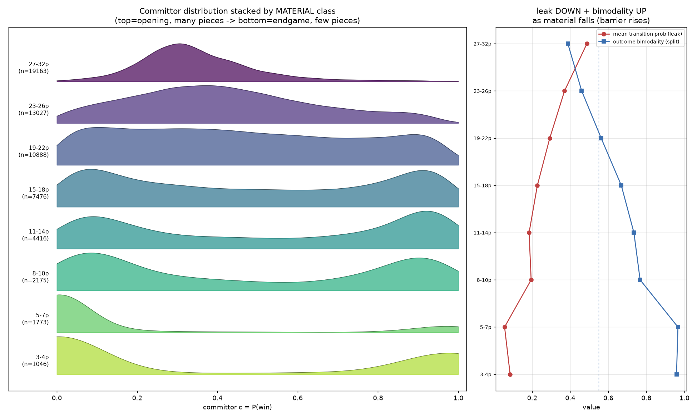

# catspace — a metastability planner for exploiting fallible chess opponents

Chess engines assume a perfect adversary. Humans aren't. **catspace** is a research
engine that plays the opponent actually sitting across the board: it models game
outcomes {Win, Draw, Loss} as **metastable basins** — under optimal play the barriers
between them are infinite; under real play every crossing is someone's **error** —
and it plans by steering toward positions where *this particular opponent* is likely
to make the outcome-flipping error and we are not.

It is also an experiment in how research gets done: an AI (Claude) builds and runs
everything; Kaveh Shoorideh directs — the questions, the reframes, and the core
calls. The whole process, including the dead ends, is in the open.

## Interesting things to see

**[JOURNAL.md](JOURNAL.md)** — the lab notebook, written as the work happened:
hypotheses, negative results, retractions, reversals, and the reasoning behind each
turn. If you read one thing, read this — it is the most honest picture of a research
project you're likely to find in a repo. (Newest entries at the bottom.)

**[MILESTONES.md](MILESTONES.md)** — the locked roadmap (M0–M8) and every recorded
design decision. Changes get their own dated entries; it is deliberately hard to
drift.

**[docs/THESIS.md](docs/THESIS.md)** — the claim and the
architecture of record, unified. A "whose math we borrow" table mapping each component to
its source theorem (attractors, ATL/rPATL, MDP reachability, proof-number search,
contrastive RL, the CVaR risk knob — each graded by how hard it was verified), a
novelty ledger with nearest prior art, and the **two-evaluator architecture**: a
learned z-conditioned reachability field for navigation (the measure side), and
legal-move search for forced tactics (the existence side), with one risk knob
interpolating between them.

**Findings so far** — each number is a committed script verdict; the story behind
each is in JOURNAL.md:

- **Per-player style is recoverable and exploitable — but only via retrieval.** A
  per-player residual `z` used *directly* overfits (−0.042 nats vs the rating
  baseline on held-out players); used as a *retriever* over clean training styles it
  beats that baseline (+0.006–0.009 nats) *and* beats a rating-matched wrong
  player's style. "Infer-then-condition" is the repo's favorite lesson.
- **You can estimate who you're playing from their moves alone.** The online
  (Elo, z) estimator discriminates a known player's style from ~10 observed moves
  and rates an unknown player from moves (Elo-MAE 142 after 40 moves, vs 205
  uninformed).
- **Blunder risk is measurable and asymmetric.** The crossing-risk primitive
  (expected committor swing under a move model, refereed by Stockfish) correlates
  ρ≈0.64 with realized crossings; weaker opponents cross 1.4–3× more in the same
  positions.
- **Where errors happen is position-driven; who errs is strength-driven.** The fast
  transition predictor finds crossing *locations* at 4.7–4.9× base rate, and its
  ranking is nearly rating-invariant (Spearman 0.95) — strength scales magnitude,
  position picks the spot.
- **Reachability is a probability, not a distance.** Making the quasimetric field
  opponent-aware failed structurally — a MIN/shortest-path object cannot represent
  sum-over-paths probability, and the measured z-lift was ~0 exactly as the theory
  predicts. Its replacement, a first-hit probability field `P(reach g | s, z)`,
  shows a positive, CI-separated style-lift in its first smoke run and calibrates
  within noise.

## Two pictures worth seeing


*The thesis in one picture: the same field embedding (UMAP), colored by actual game
outcome (blue=win, grey=draw, red=loss). Under near-perfect play (Stockfish vs
Stockfish, left) outcomes separate into basins with purity 0.81; under human play
(lichess 1400–1800, right) purity drops to 0.53. That blur is not noise to average
away — it is the object of study: fallible play crossing outcome barriers.*
(Regenerate: `experiments/engine_vs_human_basins.py`.)



*Metastability emerging as the board empties: the distribution of the committor
`c = P(win)` per material class, opening (top) to endgame (bottom). Openings are
unimodal around c≈0.3–0.5 — genuinely undecided; endgames are bimodal at 0 and 1 —
decided. Right panel: per-move transition probability ("leak") falls while outcome
bimodality rises — the barriers rise as material comes off. This is why the endgame
is tablebase territory and the exploitation happens before it.*

## What it builds on — and where the novelty is

**Built on** (imported, not reinvented; the fully-cited, verification-graded table is
in [docs/THESIS.md](docs/THESIS.md) §6):

- **Frozen Leela (lc0) trunk** for board embeddings + WDL/moves-left heads; **Maia-2**
  as the rating-conditioned human move prior; **Stockfish** as the objective referee;
  **syzygy tablebases** as endgame ground truth.
- **Transition Path Theory** (committor, reactive flux) and **MSM/PCCA metastability**
  for the basin machinery.
- **Contrastive RL / successor representations** (Eysenbach et al.; Dayan;
  Touati–Ollivier's forward-backward factorization) for the factored `⟨φ(s,z), ψ(g)⟩`
  reachability critic; **first-occupancy** (Moskovitz et al.) for the first-hit
  object.
- **Reachability games / attractors** and **proof-number search** (Allis) for forced
  tactics; **opponent-model search** (Jansen's speculative play; Donkers' PrOM) as
  the chess ancestry; **CVaR / robust MDPs** (Chow et al.; Nilim–El Ghaoui) for the
  risk knob between "likely" and "forced".
- A **Matilda-style residual** design for the per-player style embedding `z`.

**Where the novelty is** (graded *plausibly novel* — the honest novelty ledger with
nearest prior art is in THESIS §6 and the archived foundations doc):

- **Opponent-conditioned reachability:** `P(first-reach g | s, z_self, z_opp)` to
  arbitrary memorized goal regions, learned from human games. Occupancy/successor
  models conditioned on an *exogenous opponent's strength+style* don't appear in the
  prior art we could find (nearest: task-latent successor features, intention-
  conditioned occupancy, Maia-2's both-Elo outcome head).
- **Infer-then-condition** (empirical finding): a recovered per-player style vector
  overfits as a predictor but works as a *retriever* over clean training styles.
- **ε-support forced wins with certificates** (designed, not yet built): proof
  search over only the moves *this* opponent would consider, emitting a
  `∏(1−δᵢ)` probability certificate — "practically forced mate, P ≥ 0.94".
- **Crossing-risk asymmetry as one primitive:** the same referee-graded committor
  swing under the opponent's move model (their exploitable risk) or ours (our
  self-blunder term).

## Code worth reading

- [`catspace/style/estimator.py`](catspace/style/estimator.py) — the online (Elo, z)
  filter: figures out who you're playing from their moves alone.
- [`catspace/style/recover.py`](catspace/style/recover.py) — weighted-MAP style
  recovery + the infer-then-condition retrieval.
- [`catspace/transition.py`](catspace/transition.py) — the crossing-risk primitive.
- [`experiments/train_reach_head.py`](experiments/train_reach_head.py) — the factored
  reachability field, with its acceptance instrument pre-registered in the file
  header (paired z-lift CIs, wrong-z placebo, calibration bins, collapse gate).
- [`experiments/losses.py`](experiments/losses.py) — every loss term ships with
  executable invariant tests; the module docstring explains the bug that made this a
  rule.
- [`experiments/m2b_cache.py`](experiments/m2b_cache.py) — the crash-safe, resumable
  shard pattern used for every expensive precompute.
- [`experiments/msm_basins.py`](experiments/msm_basins.py) — metastable basins via
  MSM/PCCA on real games.

**The doc set, [docs/](docs/)** — five files, unified 2026-07-28:
[`THESIS.md`](docs/THESIS.md) (the claim + architecture of record),
[`COMPONENTS.md`](docs/COMPONENTS.md) (what exists, where, status),
[`TESTING.md`](docs/TESTING.md) (how claims are made — each rule cites the scar that
created it), [`RUNBOOK.md`](docs/RUNBOOK.md) (run and reproduce),
[`GLOSSARY.md`](docs/GLOSSARY.md) (the vocabulary). Plus the locked
[`MILESTONES.md`](MILESTONES.md) at root and [`JOURNAL.md`](JOURNAL.md). Superseded
documents are preserved in `docs/archive/` — the design history is part of the record.

## Component map

| Component | Where |
|---|---|
| Player model (M2b/c): style `z`, recovery, online `(Elo,z)` estimator | `catspace/style/` |
| Crossing-risk primitive (SF-refereed committor swing) | `catspace/transition.py` |
| Reachability head v1 (first-hit field) + dataset builders | `experiments/train_reach_head.py`, `experiments/build_reach_data.py`, `experiments/build_opp_positions.py` |
| Fields / embeddings (frozen lc0 trunk φ, IQE history) | `catspace/field.py`, trainers in `experiments/` |
| Goal bank + vector retrieval | `catspace/goal_bank.py`, `catspace/vectordb.py`, `catspace/memory/` |
| Canonical tested losses (no loss trains untested) | `experiments/losses.py` |
| Training scaffold (MLflow / checkpoint ladders / Tune / health gates) | `catspace/train/scaffold.py` |
| Basins / committor / tablebases | `experiments/msm_basins.py`, `catspace/tb.py` |
| Planner / engine / arena / UCI | `catspace/planner/`, `catspace/engine/`, `catspace/arena.py`, `catspace/uci.py` |
| Superseded work (kept for provenance) | `experiments/archive/`, `docs/archive/` |

## Running it

```bash
pip install -e .[nn]          # torch is the [nn] extra; lczerolens for the lc0 encoder
pytest                        # test suite
python experiments/losses.py            # unit-test the loss module
python experiments/endgame_handover.py  # unit-test the tablebase handover

# regenerate clean endgame basin data (both sides tb-optimal, all outcomes) + train the field
python experiments/gen_traj_lc0.py --games 3000 --eps 0.0 --out data/derived/traj_lc0_endgame.npz
python experiments/train_lc0_field.py --data data/derived/traj_lc0_endgame.npz --steps 18000
```

More in [docs/RUNBOOK.md](docs/RUNBOOK.md). Every training run prints a `VERDICT`
line; no number is quoted anywhere in this repo unless a script printed it. Datasets
are DVC-tracked (`.dvc` pointers in git, bytes outside). Lichess 2019-01 is already
ingested (~10 GB of shards) — reuse, don't re-ingest (`docs/ARCHITECTURE.md` §10).

## Status (2026-07-28)

M0–M2 complete: basins + Stockfish-refereed ground truth, frozen-lc0-trunk field,
player model + online estimator + crossing risk. M3 (subgoal atlas) in progress on
the new first-hit probability field — its smoke run just passed. Next: the field's
full run, opponent-style conditioning from the causal in-game estimate, then the
planner (M4) and MCTS probe (M5).
