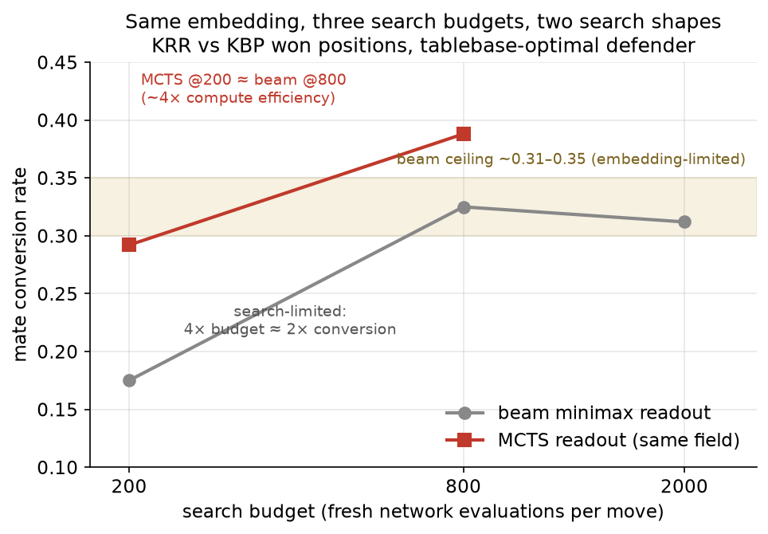

# Find your bottleneck before you A/B anything

*One topic from the catspace project: how we spent an entire overnight sweep
measuring ties, and the one measurement that explained every one of them.*

## The setup

We were trying to improve a learned evaluation field for an endgame planner.
Over one long session we tested outcome-separating losses (hard and soft),
cross-outcome repulsion terms, region-valued goals, and several fine-tune
recipes. The evaluation was solid by most standards: paired playouts on
frozen position sets against a deterministic optimal defender, bootstrap CIs,
anytime-valid e-values. Variant after variant **tied the incumbent**. We
were close to concluding that the representation had an intrinsic ceiling.

Then we ran a comparison we should have run first — the *same* weights
against themselves at different search budgets:

| search budget (evals/move) | conversion vs optimal defender |
|---|---|
| 200 | 0.175 |
| 800 | 0.325 |
| 2000 | 0.312 |

Doubling of conversion from 200 to 800 (CI [+0.050, +0.250]); saturation
after. Below ~800 evaluations the system was **search-limited**: the search
was too shallow to exploit the field's quality, so *any* two fields of
roughly similar competence tie by construction. Above it, **model-limited**:
more search buys nothing, and differences between fields finally show.

Every one of our variant A/Bs had been run at 200 nodes — in the regime where
the thing we were varying could not affect the outcome. A week of tie
verdicts was not evidence about the variants. It was evidence about the
budget.

## Why this failure mode is sneaky

- **Ties feel informative.** A tight CI around zero reads as "we tested it,
  no effect." But a tight CI around zero *in the wrong regime* is a
  measurement of the bottleneck, not of your intervention. The statistics
  were flawless; the experimental design asked the wrong stratum of the
  system.
- **The regime had moved without us noticing.** Much earlier, on the full
  board with a weak field, we had measured the opposite: node budget was a
  non-lever (scores 0.062/0.100/0.062 across 200/400/800 — noise), because
  *there* the value function was the bottleneck and deeper search just
  amplified its errors. That conclusion was true, got cached as "search depth
  doesn't matter," and silently expired when the field got better. Both
  "search doesn't matter" and "search is the whole story" were correct
  measurements — in different regimes.
- **Regime interacts with what you're testing.** After the correction we
  re-ran the shelved variants at the saturated budget. They still tied — but
  only *now* was that tie a legitimate negative result about the
  representations.

## What we do now

1. **Measure the self-scaling curve first.** Before comparing A to B, run A
   against itself across the resource axis (search depth, data, context,
   samples — whatever the analog is in your system). Find where it saturates.
2. **Run comparisons at saturation** when the question is about model
   quality, and **below saturation** when the question is about
   efficiency. State the regime in the verdict; a result without its budget
   attached doesn't transfer.
3. **Report ladders, not points.** Our play A/Bs report at 200/800/1600
   evaluations as a matter of protocol. Effects have appeared at 800+ that
   are invisible at 200 (our certainty-field promotion confirmed at 800n
   after being unconfirmable at 200n), and one architecture change (an MCTS
   readout replacing beam search) was worth ~4× compute — a fact you can only
   see *as* a ladder.
4. **Re-derive cached conclusions when the system underneath them improves.**
   "X is not a lever" has a shelf life. Ours expired without an alarm; now
   the alarm is scheduled — a regime check accompanies every major promotion.

The general form of the lesson: **a null result is a claim about your
experiment, and only sometimes about your hypothesis.** Locate the bottleneck
first; then your ties start meaning something.

