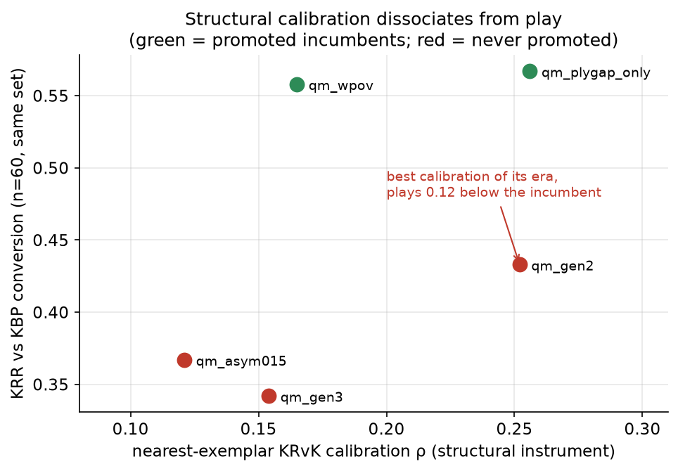

# Your instrument is not your objective

*One topic from the catspace project: seven times a representation metric
improved while play didn't. What steering signals are for, and what they must
never be allowed to decide.*

## The pattern

We train a reachability embedding for a chess planner, and we maintain a
panel of cheap structural instruments to steer the work: distance calibration
against tablebase ground truth, horizon-stratified retrieval, embedding-space
outcome separability, reach-field curvature, blunder-rate probes. They are
fast, interpretable, and grounded in exact truth. They are also, on the
record, **unable to rank checkpoints by playing strength**. Seven separate
times an intervention moved an instrument and did not move play:

1. An endgame curriculum lifted distance calibration ρ from +0.165 to +0.252
   — the best of its era. That checkpoint played 0.12 *below* the incumbent
   on the same test set.
2. Self-play distillation into a blind region raised the reach field's local
   sensitivity 7–11× and quadrupled its alignment with true mate distance.
   Conversion: unchanged-to-worse.
3. Dense, correct expert demonstrations (engine-vs-engine conversions)
   improved *every* representation metric more than self-play had — and play
   stayed null. The tell hid in a sub-metric: average move ranking improved
   while **top-1 move reliability dropped** (0.90 → 0.80). Play is argmax;
   we had been optimizing the rest of the distribution.
4. An outcome-separating loss achieved what we'd hoped for geometrically
   (win/draw/loss regions separable at 0.84 balanced accuracy in hop
   distance). The hard version *crushed* play (0.54 → 0.30); the gentle
   versions tied.
5. A distributional head's entropy — designed as an uncertainty signal —
   correlated *negatively* with the sharpness it was meant to detect.
6. Validation retrieval improved smoothly as we extended a training run 155k
   → 215k steps; the extended checkpoint lost head-to-head at play,
   decisively (composed e ≈ 48 against).
7. Our certainty-distill scaling curve: held-out field calibration was flat
   in data size while the play effect went from negative to confirmed —
   the instrument missed the thing that mattered *in both directions*.

## Why it happens

These are all versions of one mechanism: **the readout is a narrow channel,
and the instrument measures the whole representation.** A planner consumes
its field through argmax over a handful of moves under a fixed search shape.
A metric that averages over states, moves, or horizons (rank correlations,
retrieval accuracy, separability) can improve arbitrarily much in the mass of
the distribution while the top-1 decision at the positions that decide games
gets worse. Goodhart is the famous failure ("optimize the proxy and it stops
being a proxy"), but note that most of our cases weren't even Goodharting —
we weren't training on the instruments, just *selecting* by them, and
selection pressure alone was enough to decouple them.

There's a second, subtler mechanism: instruments inherit assumptions. Our
sharpness benchmark turned out to be distance-confounded (ρ +0.39 with
distance-to-mate), so everything that "detected sharpness" was partly
detecting proximity. When we deconfounded the ruler, every static signal
dropped to ~0. The instrument didn't just fail to predict the objective — it
was quietly measuring a different quantity than its name claimed.

## What instruments are actually for

None of this means throw the panel away. Every diagnosis that eventually
*did* move play came from an instrument: the flat-field discovery (top-8 move
scores spanning 0.009 in an out-of-distribution region) told us where
training data had to come from; the anti-correlation of learned distance with
conversion certainty (ρ −0.099, CI excluding zero) motivated the certainty
geometry that became the incumbent; the retrieval-horizon cliff explains
which search depths can work at all. Instruments answer **"where is it
broken and why"** with excellent specificity.

What they cannot answer is **"is this checkpoint better."** So the rules we
now operate under:

1. **Instruments steer; play promotes.** No checkpoint is promoted on any
   structural metric, ever. Promotion requires a paired play comparison with
   a CI that excludes zero, at the right search-budget regime, confirmed on a
   fresh held-out set.
2. **Validate the instrument against the objective once before trusting it
   at all** — and check it for confounds with the obvious covariates
   (distance, material, game phase). Ours failed these checks often enough
   that this is now a standing step.
3. **When instrument and objective disagree, the objective is right and the
   *disagreement* is the finding.** Case 3's rank-vs-argmax split told us our
   training loss optimizes distributional ordering, not decisions — a real
   architectural fact we'd never have articulated if we'd trusted either
   number alone.
4. **Prefer instruments whose units are decisions.** "Fraction of positions
   where the top-ranked move preserves the win" predicted play far better
   than any rank correlation. If the system acts by argmax, measure the
   argmax.
