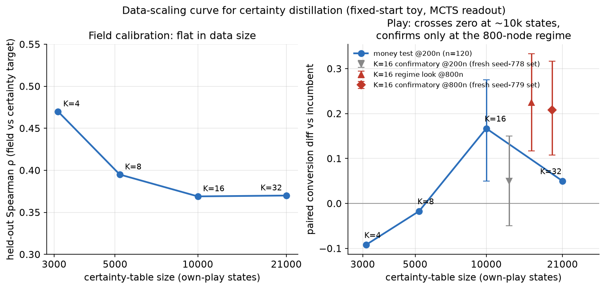
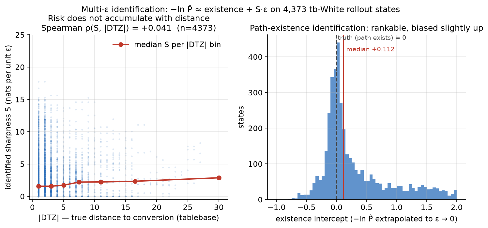
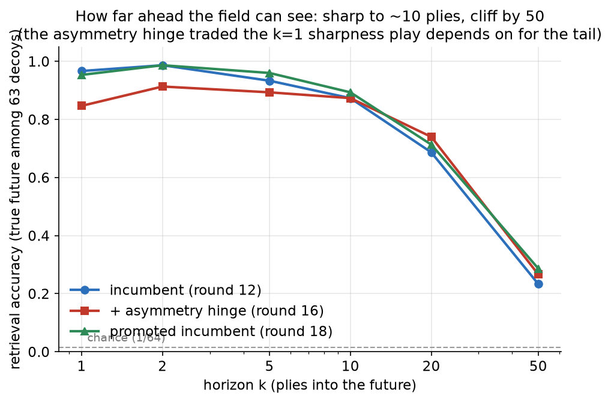
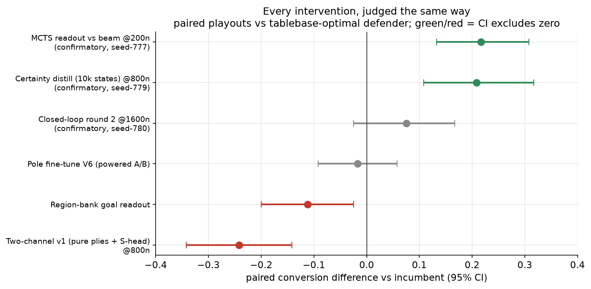

# Planning in a learned reachability field: what we know so far

*catspace research review — 2026-07-15. Every number in this article is copied
verbatim from a printed script verdict recorded in JOURNAL.md; every figure is
generated by `experiments/viz/article_figures.py` from git-tracked artifacts or
those same verdicts. Companion piece: [the research journey](research_journey.md)
(everything that didn't work, and what it taught us).*

## What this project is

catspace asks what it takes to learn **human-like planning** in chess — the kind
you hear in a strong player's commentary: "first win the bishop, then drive the
king to the corner, then mate." Chess is the toy domain because verification is
cheap (tablebases, engines, exact rules); the intended payoff is agentic
planning beyond chess, especially robotics.

The core bet is a **reachability embedding**, not a value function. Two
encoders, `F(s)` for states and `B(g)` for goals, are trained on real games so
that `score(F(s), B(g))` says how reachably `g` follows from `s` under real
play. Planning is navigation toward a goal region in this space — there is
deliberately no win/draw/loss value head (that would just be Leela). Search
budgets are kept small (~200–1600 network evaluations per move, roughly 10–80×
below Leela's competitive node counts) so that any win has to come from the
*plan*, not from out-searching the opponent.

The proving ground is one fixed endgame: White K+R+R vs Black K+B+P
(**KRRvKBP**), started from a single canonical position, with every training and
evaluation state reachable by play from it. Tablebases confirm the starting
positions are won; they are used only to *grade* the planner (and to play a
deterministic optimal defender in evaluations), never to train it — a
source-inspecting leakage audit gates every experiment.

Two hypotheses organize everything:

1. **H1 — the FB decomposition can capture the structure of the field.** A
   factorized reachability score, trained contrastively on which states
   actually follow which, learns enough geometry to plan in.
2. **H2 — the right loss function is one that prices our likelihood of actually
   converting.** Distance to a goal should not be "length of the best line"
   but "length plus how likely we are to find and hold the line."

Neither is fully won yet — we have not reliably converted the toy endgame — but
both have moved from conjecture to measured claims with confirmed pieces. Here
is the current state, most load-bearing findings first.

---

## Finding 1 — Certainty *is* the distance (H2, confirmed twice)

The single most consequential measurement of the project: the naive
reachability metric is **anti-correlated with certainty**. When we estimated,
by stochastic rollouts, each state's probability P̂ of actually converting the
win, the incumbent field's learned distance had held-out Spearman
**−0.099 (CI [−0.175, −0.027])** against the certainty target
`plies + λ·(−ln P̂)`. A contrastive/shortest-path-flavored objective learns
*min semantics* — "one winning line exists = close" — which is precisely
optimism a fallible searcher cannot cash. A messy position with a single
winning needle scored *closer* than a slightly longer forced win.

The fix is a redefinition of closeness: **d(s,g) = plies + λ·(−ln P(reach
g))**. Because −ln P chains multiplicatively along paths it is subadditive, so
the certainty term is itself a quasimetric — certainty and hops unify in one
distance, and a forced win (P=1) reduces to pure move count.

This claim was earned the hard way, through a data-scaling curve and two
pre-registered confirmatory runs on never-touched, single-use position sets:

Distilling the certainty target into the field from the planner's **own
rollout data** crossed from hurting to helping at roughly 10k on-distribution
states, and confirmed decisively at the 800-node regime: **0.400 → 0.608
conversion against a tablebase-optimal defender (diff +0.208, CI
[+0.108, +0.317], e = 184.7)** on a frozen confirmatory set. Note the left
panel: the *calibration* metric was flat in data size while play moved — the
instrument and the objective are different things (a recurring theme; see the
journey article).

The result then transferred out of the toy: training certainty into the **base
objective at full-board scale** (an outcome-conditioned P-head plus the
certainty term on won games, no oracle labels anywhere) produced
`cert_base_full`, which beat the pre-certainty incumbent head-to-head **34–7
across two independently-seeded runs (composed e = 539)** — and matched a
10k-state toy-distilled specialist on the specialist's home turf with zero toy
data in its diet.

Two follow-up results sharpen H2:

- **Sharpness is real, and it is not path length.** Estimating P̂ at several
  noise levels ε identifies, per state, a path-existence term and a sharpness
  slope S (how fast −ln P̂ grows with fallibility). Measured on 4,373 states:
  **Spearman ρ(S, |DTZ|) ≈ +0.04** — essentially zero. Risk does not
  accumulate with distance; it concentrates in bottlenecks. A guaranteed
  mate-in-15 genuinely is closer than a 37%-convertible mate-in-7, and the
  data says these two axes are independent channels.

  

- **But the fusion is load-bearing.** Splitting the geometry into a pure-plies
  channel plus a separately-learned sharpness head, with risk applied only at
  readout, was **falsified at play** (−0.242, CI [−0.342, −0.142] at 800
  nodes). Certainty has to live *in* the geometry the search descends, not be
  bolted on after. How to give sharpness its own full-strength channel without
  losing that is the current open design question.

## Finding 2 — Know which regime you're in before you conclude anything

For a long stretch, every intervention we tried "tied the incumbent," and we
nearly concluded the embedding had an intrinsic ceiling. The resolution was a
measurement, not an idea:

On the same weights, conversion against an optimal defender went **0.175 at
200 evals → 0.325 at 800 → 0.312 at 2000**. Below ~800 evaluations the system
is **search-limited** — the field's quality cannot show, so every
field-improvement A/B run at 200 nodes tied *by construction*. At saturation
it is **embedding-limited**, and that is where field changes must be judged.
Re-testing our shelved variants at the correct regime changed none of their
verdicts, but it changed which conclusions we were entitled to.

The same figure carries the second promotion: replacing beam minimax with a
value-only **PUCT MCTS** readout of the same field was worth as much as 4× the
compute (MCTS at 200 ≈ beam at 800), confirmed on a fresh frozen set at
**+0.217 (CI [+0.133, +0.308])**. Every "ceiling" we had measured before was
partly the readout wasting budget.

## Finding 3 — What the FB field actually learns (H1, qualified support)

The decomposition does capture real structure, with measured shape and
measured limits:

- **Horizon.** In a 64-way recognition test (pick the true future among
  decoys), the field is near-perfect to ~10 plies ahead and falls off a cliff
  by 50. Auxiliary losses that improved the far tail (e.g. an asymmetry hinge
  encoding "captures are one-way doors") consistently *taxed* the short-horizon
  sharpness that move selection lives on — the central tension of the
  single-embedding design.

  

- **Capacity is not the constraint.** Effective rank of F is ~10 of 64
  dimensions; the trunk itself ~10 of 256. The objective's information demand,
  not width, is what binds — "do not widen" is a measured conclusion.

- **Geometry absorbs what the objective asks and nothing more.** With
  certainty in the base objective, a zero-label outcome readout of the raw
  geometry improved (outcome-probe AUC 0.610 → 0.687), and the old
  trunk-vs-F information bottleneck flipped sign. Conversely, in regions human
  games never visit, the field was measurably *flat* — top-8 move scores
  spanning 0.009, winning moves ranked #10–#27 — until the planner's own play
  in that region supplied training signal. Coverage is destiny; the objective
  can't calibrate where no gradient reaches.

## Finding 4 — The instruments are not the objective

We built a six-instrument fitness probe (tablebase calibration, horizon
retrieval, asymmetry, triangle violations, degeneracy) and it earns its keep as
a *diagnostic* — but it does not rank checkpoints by play:

The best-calibrated checkpoint of its era played 0.12 *below* the incumbent.
Seven separate times, an intervention improved a representational metric while
play stayed flat or regressed. The project's hard rule now: structural
instruments steer *where to look*; only paired play with confidence intervals
decides *what is true*. The full ledger, judged uniformly:

## Where we are right now

The current incumbent (`cert_base_full`, certainty-in-base-objective, 155k
steps) converts **0.500 / 0.692 / 0.733** of won fixed-start KRRvKBP positions
against a tablebase-optimal defender at 200/800/1600 evaluations. The
residual failure mode is diagnosed and visual: games drive the certainty
distance from ~0.55 down to a **floor of ~0.30 and then orbit the rim** —
near-goal states become indistinguishable, the search shuffles equal-distance
moves, and the game bleeds into threefold repetition while the win-probability
head still reads 0.85+. Wins keep moving through embedding space in their last
ten plies (net F-displacement 1.9–16); failures don't (0.5–0.7).

Three exploration-restoring mechanisms aimed at exactly this (blending live
search evidence into the field, random rollouts where the field is flat or
unvouched, and tree reuse across moves) are under a pre-registered A/B ladder
as this is written; the first rung came back **negative** (0.625 vs 0.700 at
800n, not significant), so the rim problem is still open.

The gate before scaling up is explicit: **reliably convert this one endgame —
capture the bishop, corner the king, mate — under a small search budget,
before any full-board data campaign.** Named concepts like "pin" and "corner"
exist only in our offline verification instruments (stage checkers validated
against expert games); play and search never see them. When they eventually
appear, they must be discovered structure in the embedding, named by us after
the fact.

## How the comparisons are made (the methodology is a finding too)

Every play claim above comes from the same harness. Two policies play the
**same frozen set of tablebase-won starting positions** with matched seeds,
against a **deterministic tablebase-optimal defender** (Syzygy-guided; we
switched to it after discovering that Stockfish's skill-limiting uses its own
internal randomness, which had silently turned our "paired" comparisons into
noisier unpaired ones). Each start yields a paired outcome difference
(converted-to-mate or not, plus plies-to-mate when both convert); the headline
number is the mean paired difference with a **bootstrap 95% CI** over starts.

Significance uses an **anytime-valid e-process** (`catspace/abtest.py`) rather
than a fixed-n p-value, because we look at results as games stream in and stop
runs early. The e-value is a nonnegative supermartingale under the null —
think of it as accumulated winnings from betting against "no difference" —
so it can be monitored continuously: crossing 1/α (= 20 at the 5% level)
rejects, e ≪ 1 means the data actively favor the null, and *optional stopping
or extending a run is legitimate by construction* (we used this to extend a
promising 1600-node look from n = 120 to n = 200 without a peeking penalty,
and to stop an oracle-field search duel at n = 47 of 120 once e hit 23.7).
E-values from independent runs **multiply**: the full-board promotion combines
two independently-seeded head-to-heads (e = 65.1 and e = 8.3) into a composed
e = 539. For paired per-move quantities on fixed positions (the ACPL blunder
probe), we instead use a **Wilcoxon signed-rank test** plus a bootstrap CI on
the mean centipawn difference; calibration claims are **Spearman rank
correlations with bootstrap CIs** on held-out states.

The sequential freedom is paid for with selection discipline. Exploratory
sweeps (a scaling curve, a hyperparameter ladder) are declared exploratory;
the selected winner then gets **one pre-registered confirmatory run on a
fresh, single-use frozen start set** (minted by seed, recorded and marked
consumed in `artifacts/experiments/data_registry.json`, and the generator
refuses to reuse a seed). This protocol cut both ways in the same week: it
killed a selected result (K=16's exploratory +0.167 at 200 nodes confirmed at
only +0.050, ns — a textbook winner's curse across four looks) and it
delivered the real promotion (+0.208, CI [+0.108, +0.317], e = 184.7 at 800
nodes on a different fresh set). Point estimates alone are banned from
promotion decisions since an n = 60 "win" of +0.058 evaporated to −0.005
(e = 0.09) under the powered harness. Because deeper search changes what a
comparison can even detect (Finding 2), play A/Bs are reported at fixed rungs
of a **budget ladder** (200/800/1600 evaluations), never at a single budget.

Two validity gates wrap all of it. A **source-inspecting leakage audit**
(`catspace/audit.py`) re-reads the actual training and readout code paths at
call time for any oracle-derived identifier and stamps provenance into every
checkpoint — engine and tablebase signals grade the planner and defend
against it, but never train it; every arena run aborts hard if the audit
fails. And **no number enters the journal or this article without a printed
script verdict**: one plausible-sounding "memorization" diagnosis was
formally retracted when its headline number turned out to exist only in
prose, and the figures here are generated by a committed script from
git-tracked artifacts, with each verdict-sourced number carrying its JOURNAL
provenance inline.

## Where the data lives, and how to reproduce it

The quantitative history is git-tracked under `artifacts/experiments/`:
structured JSON for every evaluation run, the frozen train/test/confirmatory
position sets, the rollout-derived certainty tables
(`certainty_table_*.json`), the sharpness identification
(`sharpness_table.json`), and the field-health probes (`qm_fitness_*.json`).
Heavy inputs (Lichess shards, self-play games, checkpoints, Syzygy
tablebases) live under `data/` and are reproducible from the commands in the
repo README — see **"Reproducing the journaled results"** in
[README.md](../README.md) for the result-by-result map from claim to data
file to command. The figures in this article regenerate with
`python experiments/viz/article_figures.py`. Round-level narrative:
[JOURNAL.md](../JOURNAL.md). Vocabulary: [GLOSSARY.md](../GLOSSARY.md).
